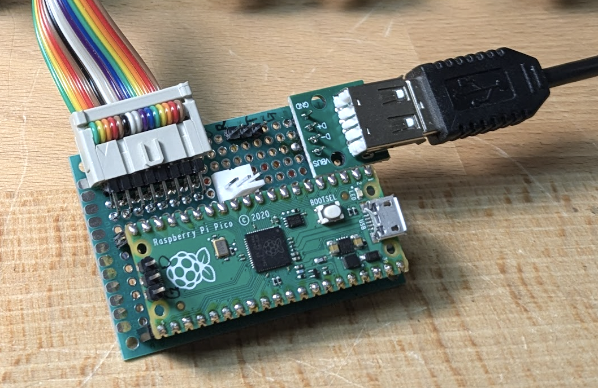

# pico-ascii-keyboard - A USB to ASCII keyboard converter

This program converts a USB keyboard to output parallel ASCII data, as
is required for early microcomputer systems (i.e. Apple I/II, MFA
Mikrocomputer etc.).  Aside from a Raspberry Pi Pico, it requires no
active components.  The +5V power supply for the Pico needs to be
provided by the host.

Connections required:

| Pico pin | Pin# | Host signal |
| -------- | ---- | ----------- |
| VBUS     | 40   | +5V         |
| GND      | 38   | GND         |
| GP12     | 16   | D0          |
| GP13     | 17   | D1          |
| GP14     | 19   | D2          |
| GP15     | 20   | D3          |
| GP16     | 21   | D4          |
| GP17     | 22   | D5          |
| GP18     | 24   | D6          |
| GP19     | 25   | D7          |
| GP10     | 26   | STB         |
| GP11     | 27   | AKD         |

The STB (Strobe) and AKD (Any Key Down) signals are active high.

You can use a USB OTG adapter cable to connect the keyboard to the
Mini USB port on the Raspberry Pi Pico.  Alternatively, you can mount
a USB A socket on your board and run wires to the test points on the
bottom of the Pi Pico.  TP1 is ground, TP2 is D- and TP3 is D+.
You'll also need to connect VBUS to the USB socket to power the
keyboard.

Here's a picture of my prototype:

# Using

The file [pico-asci-keyboard.uf2](./pico-ascii-keyboard.uf2) contains
a precompiled binary that you can
[install](https://www.raspberrypi.com/documentation/microcontrollers/c_sdk.html#your-first-binaries)
on your Pi Pico to get started.  Debug information is printed on the
serial port at 115200 bps.

# Compiling

Follow the
[instructions](https://www.raspberrypi.com/documentation/microcontrollers/c_sdk.html)
to set up the Raspberry Pi Pico SDK.  Create a `build` directory, `cd`
to it and type `cmake .. -DPICO_SDK_PATH=<path-to-pico-sdk> && make`
to compile.  The resulting `pico-asci-keyboard.uf2` file can then be
installed on the Pico.
